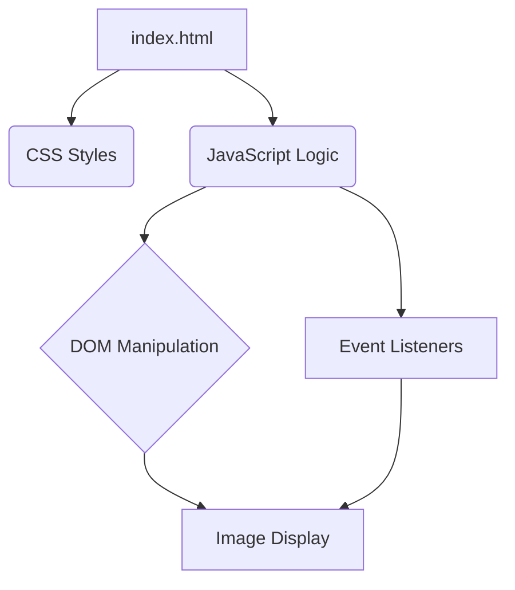

# JavaScript Image Gallery


## Overview

This project features an **Interactive Image Gallery** developed using pure JavaScript, HTML, and CSS. It was designed to be a lightweight and efficient solution for displaying image collections dynamically and responsively. The gallery allows navigation between images, full-screen viewing, and is easily integrable into any web project.

## Features

*   **Intuitive Navigation**: Navigation buttons and thumbnails for easy access to images.
*   **Responsiveness**: Adapts to different screen sizes, providing a consistent experience on mobile devices and desktops.
*   **Full-Screen Mode**: Option to view images in full-screen for an immersive experience.
*   **Dynamic Loading**: Support for dynamically adding and removing images.

## Architecture



## How to Use

### Installation

No complex installation is required. Simply clone the repository and open the `index.html` file in your browser.

```bash
git clone https://github.com/galafis/javascript-image-gallery.git
cd javascript-image-gallery
# Open index.html in your browser
```

### Project Structure

```
.  
├── docs/  
│   ├── README.original.md  
│   ├── README.pt.md  
│   └── README.en.md  
├── src/  
│   └── index.js  
├── index.html  
├── style.css  
└── README.md  
```

### Usage Example

To add images to the gallery, edit the `index.html` file and include your images within a specific container, or use the JavaScript API to add them dynamically.

```html
<div id="gallery-container">
    
    
</div>
```

## Contribution

Contributions are welcome! Feel free to open issues or submit pull requests for improvements, bug fixes, or new features.

## Author

**Gabriel Demetrios Lafis**

*   [GitHub](https://github.com/galafis)
*   [LinkedIn](https://www.linkedin.com/in/gabriel-demetrios-lafis/)

## License

This project is licensed under the MIT License. See the `LICENSE` file for more details.

