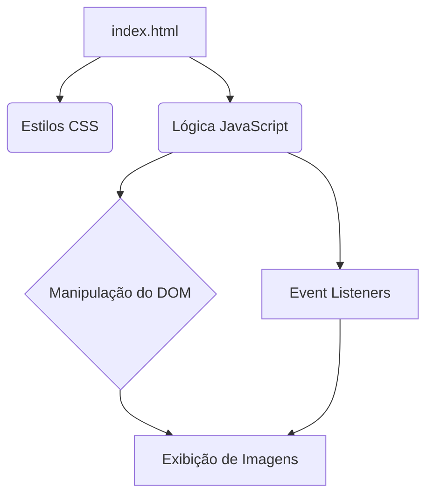

# Galeria de Imagens em JavaScript


## Visão Geral

Este projeto apresenta uma **Galeria de Imagens Interativa** desenvolvida em JavaScript puro, HTML e CSS. Foi concebido para ser uma solução leve e eficiente para exibir coleções de imagens de forma dinâmica e responsiva. A galeria permite a navegação entre imagens, visualização em tela cheia e é facilmente integrável em qualquer projeto web.

## Funcionalidades

*   **Navegação Intuitiva**: Botões de navegação e miniaturas para fácil acesso às imagens.
*   **Responsividade**: Adapta-se a diferentes tamanhos de tela, proporcionando uma experiência consistente em dispositivos móveis e desktops.
*   **Modo Tela Cheia**: Opção para visualizar imagens em tela cheia para uma experiência imersiva.
*   **Carregamento Dinâmico**: Suporte para adicionar e remover imagens dinamicamente.

## Arquitetura



## Como Usar

### Instalação

Não é necessária instalação complexa. Basta clonar o repositório e abrir o arquivo `index.html` em seu navegador.

```bash
git clone https://github.com/galafis/javascript-image-gallery.git
cd javascript-image-gallery
# Abra index.html no seu navegador
```

### Estrutura do Projeto

```
.  
├── docs/  
│   ├── README.original.md  
│   ├── README.pt.md  
│   └── README.en.md  
├── src/  
│   └── index.js  
├── index.html  
├── style.css  
└── README.md  
```

### Exemplo de Uso

Para adicionar imagens à galeria, edite o arquivo `index.html` e inclua suas imagens dentro de um contêiner específico, ou utilize a API JavaScript para adicionar dinamicamente.

```html
<div id="gallery-container">
    
    
</div>
```

## Contribuição

Contribuições são bem-vindas! Sinta-se à vontade para abrir issues ou enviar pull requests para melhorias, correção de bugs ou novas funcionalidades.

## Autor

**Gabriel Demetrios Lafis**

*   [GitHub](https://github.com/galafis)
*   [LinkedIn](https://www.linkedin.com/in/gabriel-demetrios-lafis/)

## Licença

Este projeto está licenciado sob a Licença MIT. Veja o arquivo `LICENSE` para mais detalhes.

